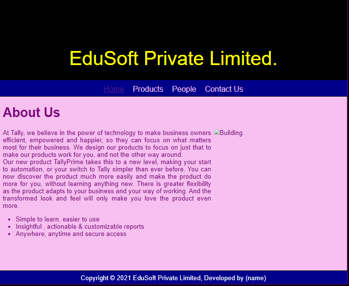
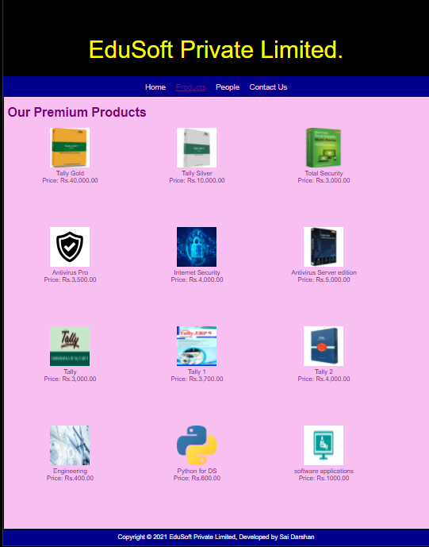

# Web Design for a Software Product Company

## AIM:

To design a static website for a software product company company.

## DESIGN STEPS:

### Step 1:

Requirement collection.

### Step 2:

Creating the layout using HTML and CSS.

### Step 3:

Updating the sample content.

### Step 4:

Choose the appropriate style and color scheme.

### Step 5:

Validate the layout in various browsers.

### Step 6:

Validate the HTML code.

### Step 6:

Publish the website in the given URL.

## PROGRAM :
```
<!DOCTYPE html>
<html lang="en">
  <head>
    <title>EduSoft Private Limited</title>
    <link rel="icon" href="lo.jpg" type="image/x-icon" />
  </head>
  <body>
<style>
* {
  box-sizing: border-box;
  font-family: Arial, Helvetica, sans-serif;
}
body {
  background-color:black;
  color:purple;
}
.container {
  width: 1080px;
  margin-left: auto;
  margin-right: auto;
  border-width: 1px 1px 1px 1px;
  border-style: solid;
  box-shadow: 15px 15px 8px black;
}

.banner {
  display: block;
  width: 100%;
  height: 250px;
  text-align: center;
  font-size: 60px;
  background-image:"lo.jpg";
  background-size: 100% 100%;
  margin: 0px 0px 0px 0px;
  padding-top: 150px;
  color: yellow;
}

.menu {
  display: block;
  width: 100%;
  height: 50px;
  font-size: larger;
  background-color: darkblue;
  text-align: center;
  padding-top: 15px;
  margin: 0px 0px 0px 0px;
  border-width: 1px;
}

.menuitem {
  display: inline-block;
  margin-left: 10px;
  margin-right: 10px;
}
.menuitemselected {
  display: inline-block;
  margin-left: 10px;
  margin-right: 10px;
  color: purple;
}

.menuitem a {
  text-decoration: none;
  color: #f8c0f1;
}

.content {
  display: block;
  width: 100%;
  background-color: #f8c0f1;
  min-height: 500px;
  margin: 0px 0px 0px 0px;
  border-width: 1px;
  border-color: black;
  border-style: solid;
}
.homecontent {
  min-height: 500px;
  margin: 10px 10px 10px 10px;
}
.homecontent h1 {
  text-align: left;
}
.homecontent img {
  float: right;
  width: 400px;
  height: 300px;
  margin-left: 10px;
}

.contenttext {
  text-align: justify;
  color:purple;
}

.productcontent {
  min-height: 500px;
  margin: 10px 10px 10px 10px;
}

.productcontent h1 {
  text-align: left;
}

.productitems {
  display: block;
}

.productitem {
  display: inline-block;
  width: 30%;
  height: 250px;
  text-align: center;
}

.productitem img {
  width: 100px;
  height: 100px;
  display: block;
}
.productitem .itemimage {
  display: block;
  margin-left: auto;
  margin-right: auto;
  width: 100px;
  margin-bottom: 5px;
}

.productitem .itemname {
  display: block;
}
.productitem .itemprice {
  display: block;
}

.footer {
  display: block;
  width: 100%;
  height: 40px;
  background-color: darkblue;
  text-align: center;
  padding-top: 10px;
  margin: 0px 0px 0px 0px;
  color: white;
}
</style>
    <div class="container">
      <div class="banner">EduSoft Private Limited.</div>
      <div class="menu">
        <div class="menuitemselected"><a href="home.html">Home</a></div>
        <div class="menuitem"><a href="products.html">Products</a></div>
        <div class="menuitem"><a href="contact.html">People</a></div>
        <div class="menuitem"><a href="address.html">Contact Us</a></div>
      </div>
      <div class="content">
        <div class="homecontent">
          <h1>About Us</h1>
          
          <div class="contenttext">
            At Tally, we believe in the power of technology to make business
            owners efficient, empowered and happier, so they can focus on what
            matters most for their business. We design our products to focus on
            just that to make our products work for you, and not the other way
            around.
            <br />
            Our new product TallyPrime takes this to a new level, making your
            start to automation, or your switch to Tally simpler than ever
            before. You can now discover the product much more easily and make
            the product do more for you, without learning anything new. There is
            greater flexibility as the product adapts to your business and your
            way of working. And the transformed look and feel will only make you
            love the product even more.
            <ul>
              <li>Simple to learn, easier to use</li>
              <li>Insightful , actionable & customizable reports</li>
              <li>Anywhere, anytime and secure access</li>
            </ul>
          </div>
        </div>
      </div>
      <div class="footer">
        Copyright &#169; 2021 EduSoft Private Limited, Developed by (name)
      </div>
    </div>
  </body>
</html>

<!DOCTYPE html>
<html lang="en">
  <head>
    <title>EduSoft Private Limited</title>
    <link rel="stylesheet" href="./css/layout.css" />
    <link rel="icon" href="./img/globee.png" type="image/x-icon" />
  </head>
 <body>
<style>
* {
  box-sizing: border-box;
  font-family: Arial, Helvetica, sans-serif;
}
body {
  background-color:black;
  color:purple;
}
.container {
  width: 1080px;
  margin-left: auto;
  margin-right: auto;
  border-width: 1px 1px 1px 1px;
  border-style: solid;
  box-shadow: 15px 15px 8px black;
}

.banner {
  display: block;
  width: 100%;
  height: 250px;
  text-align: center;
  font-size: 60px;
  background-image:"lo.jpg";
  background-size: 100% 100%;
  margin: 0px 0px 0px 0px;
  padding-top: 150px;
  color: yellow;
}

.menu {
  display: block;
  width: 100%;
  height: 50px;
  font-size: larger;
  background-color: darkblue;
  text-align: center;
  padding-top: 15px;
  margin: 0px 0px 0px 0px;
  border-width: 1px;
}

.menuitem {
  display: inline-block;
  margin-left: 10px;
  margin-right: 10px;
}
.menuitemselected {
  display: inline-block;
  margin-left: 10px;
  margin-right: 10px;
  color: purple;
}

.menuitem a {
  text-decoration: none;
  color: #f8c0f1;
}

.content {
  display: block;
  width: 100%;
  background-color: #f8c0f1;
  min-height: 500px;
  margin: 0px 0px 0px 0px;
  border-width: 1px;
  border-color: black;
  border-style: solid;
}
.homecontent {
  min-height: 500px;
  margin: 10px 10px 10px 10px;
}
.homecontent h1 {
  text-align: left;
}
.homecontent img {
  float: right;
  width: 400px;
  height: 300px;
  margin-left: 10px;
}

.contenttext {
  text-align: justify;
  color:purple;
}

.productcontent {
  min-height: 500px;
  margin: 10px 10px 10px 10px;
}

.productcontent h1 {
  text-align: left;
}

.productitems {
  display: block;
}

.productitem {
  display: inline-block;
  width: 30%;
  height: 250px;
  text-align: center;
}

.productitem img {
  width: 100px;
  height: 100px;
  display: block;
}
.productitem .itemimage {
  display: block;
  margin-left: auto;
  margin-right: auto;
  width: 100px;
  margin-bottom: 5px;
}

.productitem .itemname {
  display: block;
}
.productitem .itemprice {
  display: block;
}

.footer {
  display: block;
  width: 100%;
  height: 40px;
  background-color: darkblue;
  text-align: center;
  padding-top: 10px;
  margin: 0px 0px 0px 0px;
  color: white;
}
</style>
    <div class="container">
      <div class="banner">EduSoft Private Limited.</div>
      <div class="menu">
        <div class="menuitem"><a href="home.html">Home</a></div>
        <div class="menuitemselected"><a href="products.html">Products</a></div>  
        <div class="menuitem"><a href="contact.html">People</a></div>
        <div class="menuitem"><a href="address.html">Contact Us</a></div>
      </div>
      <div class="content">
        <div class="productcontent">    
          <h1>Our Premium Products</h1>
          <div class="productitems">
              <div class="productitem"> 
                  <div class="itemimage">
                  
                  </div>
                  <div class="itemname">Tally Gold</div>
                  <div class="itemprice">Price: Rs.40,000.00 </div>
              </div>
              <div class="productitem"> 
                  <div class="itemimage">
                  
                  </div>
                  <div class="itemname">Tally Silver</div>
                  <div class="itemprice">Price: Rs.10,000.00 </div>
              </div>
              <div class="productitem"> 
                <div class="itemimage">
                
                </div>
                <div class="itemname">Total Security</div>
                <div class="itemprice">Price: Rs.3,000.00 </div>
              </div>
              <div class="productitem"> 
                <div class="itemimage">
                
                </div>
                <div class="itemname">Antivirus Pro</div>
                <div class="itemprice">Price: Rs.3,500.00 </div>
              </div>
              <div class="productitem"> 
                <div class="itemimage">
                
                </div>
                <div class="itemname">Internet Security</div>
                <div class="itemprice">Price: Rs.4,000.00 </div>
              </div>
              <div class="productitem"> 
                <div class="itemimage">
                
                </div>
                <div class="itemname">Antivirus Server edition</div>
                <div class="itemprice">Price: Rs.5,000.00 </div>
              </div>
              <div class="productitem"> 
                <div class="itemimage">
                
                </div>
                <div class="itemname">Tally</div>
                <div class="itemprice">Price: Rs.3,000.00 </div>
              </div>
              <div class="productitem"> 
                <div class="itemimage">
                
                </div>
                <div class="itemname">Tally 1</div>
                <div class="itemprice">Price: Rs.3,700.00 </div>
              </div>
              <div class="productitem"> 
                <div class="itemimage">
                
                </div>
                <div class="itemname">Tally 2</div>
                <div class="itemprice">Price: Rs.4,000.00 </div>
              </div>
              <div class="productitem"> 
                <div class="itemimage">
                
                </div>
                <div class="itemname">Engineering</div>
                <div class="itemprice">Price: Rs.400.00 </div>
              </div>
              <div class="productitem"> 
                <div class="itemimage">
                
                </div>
                <div class="itemname">Python for DS</div>
                <div class="itemprice">Price: Rs.600.00 </div>
              </div>
              <div class="productitem"> 
                <div class="itemimage">
                
                </div>
                <div class="itemname">software applications</div>
                <div class="itemprice">Price: Rs.1000.00 </div>
              </div>
          </div>
          </div>        
      </div>
      <div class="footer">
        Copyright &#169; 2021 EduSoft Private Limited, Developed by Sai Darshan
      </div>
    </div>
  </body>
</html>

<!DOCTYPE html>
<html lang="en">
  <head>
    <title>EduSoft Private Limited</title>
    <link rel="icon" href="./img/globee.png" type="image/x-icon" />
  </head>

  <body>
<style>
* {
  box-sizing: border-box;
  font-family: Arial, Helvetica, sans-serif;
}
body {
  background-color:black;
  color:purple;
}
.container {
  width: 1080px;
  margin-left: auto;
  margin-right: auto;
  border-width: 1px 1px 1px 1px;
  border-style: solid;
  box-shadow: 15px 15px 8px 8px;
}

.banner {
  display: block;
  width: 100%;
  height: 250px;
  text-align: center;
  font-size: 60px;
  background-image:"lo.jpg";
  background-size: 100% 100%;
  margin: 0px 0px 0px 0px;
  padding-top: 150px;
  color: yellow;
}

.menu {
  display: block;
  width: 100%;
  height: 50px;
  font-size: larger;
  background-color: darkblue;
  text-align: center;
  padding-top: 15px;
  margin: 0px 0px 0px 0px;
  border-width: 1px;
}

.menuitem {
  display: inline-block;
  margin-left: 10px;
  margin-right: 10px;
}
.menuitemselected {
  display: inline-block;
  margin-left: 10px;
  margin-right: 10px;
  color: purple;
}

.menuitem a {
  text-decoration: none;
  color: #f8c0f1;
}

.content {
  display: block;
  width: 100%;
  background-color: #f8c0f1;
  min-height: 500px;
  margin: 0px 0px 0px 0px;
  border-width: 1px;
  border-color: black;
  border-style: solid;
}
.homecontent {
  min-height: 500px;
  margin: 10px 10px 10px 10px;
}
.homecontent h1 {
  text-align: left;
}
.homecontent img {
  float: right;
  width: 400px;
  height: 300px;
  margin-left: 10px;
}

.contenttext {
  text-align: justify;
  color:purple;
}

.productcontent {
  min-height: 500px;
  margin: 10px 10px 10px 10px;
}

.productcontent h1 {
  text-align: left;
}

.productitems {
  display: block;
}

.productitem {
  display: inline-block;
  width: 30%;
  height: 250px;
  text-align: center;
}

.productitem img {
  width: 100px;
  height: 100px;
  display: block;
}
.productitem .itemimage {
  display: block;
  margin-left: auto;
  margin-right: auto;
  width: 100px;
  margin-bottom: 5px;
}

.productitem .itemname {
  display: block;
}
.productitem .itemprice {
  display: block;
}

.footer {
  display: block;
  width: 100%;
  height: 40px;
  background-color: darkblue;
  text-align: center;
  padding-top: 10px;
  margin: 0px 0px 0px 0px;
  color: white;
}
</style>
    <div class="container">
      <div class="banner">EduSoft Private Limited.</div>
      <div class="menu">
        <div class="menuitem"><a href="home.html">Home</a></div>
        <div class="menuitem"><a href="products.html">Products</a></div>  
        <div class="menuitemselected"><a href ="contact.html"></a>People</a></div>
        <div class="menuitem"><a href="address.html">Contact Us</a></div>
      </div>
      <div class="content">
      <div class="productitem"> 
        <div class="itemimage">
        
      </div>
         <div class="itemname">Navnit Nakra</div>
         <div class="itemname">CEO of Oneplus</div>
      </div>
      <div class="productitem"> 
        <div class="itemimage">
        
      </div>
         <div class="itemname">Jim Lanzone</div>
         <div class="itemname">CEO of Yahoo </div>
      </div>
      <div class="productitem"> 
        <div class="itemimage">
        
      </div>
        <div class="itemname">Benedetto vigna</div>
        <div class="itemname">CEO of Ferrari</div>
      </div>
      <div class="productitem"> 
        <div class="itemimage">
        
      </div>
        <div class="itemname">Marc Llistosella</div>
        <div class="itemname">CEO of Tata Motors</div>
      </div>
      <div class="productitem"> 
        <div class="itemimage">
        
      </div>
        <div class="itemname">Sundar Pichai</div>
        <div class="itemname">CEO of Google and alphabet</div>
      </div>
      <div class="productitem"> 
        <div class="itemimage">
        
      </div>
        <div class="itemname">Satya nadella</div>
        <div class="itemname">CEO of Microsoft</div>
      </div>
      <div class="footer">
        Copyright &#169; 2021 EduSoft Private Limited, Developed by Sai Darshan
      </div>
    </div>
  </body>
</html>

<html lang="en">
  <head>
    <title>EduSoft Private Limited</title>
    <link rel="stylesheet" href="./css/layout.css" />
    <link rel="icon" href="./img/globee.png" type="image/x-icon" />
  </head>
  
  <body>
<style>
* {
  box-sizing: border-box;
  font-family: Arial, Helvetica, sans-serif;
}
body {
  background-color: white;
  color:purple;
}
.container {
  width: 1080px;
  margin-left: auto;
  margin-right: auto;
  border-width: 1px 1px 1px 1px;
  border-style: solid;
  box-shadow: 15px 15px 8px black;
}

.banner {
  display: block;
  width: 100%;
  height: 250px;
  text-align: center;
  font-size: 60px;
  background-image: url("/static/img/ban.jpg");
  background-size: 100% 100%;
  margin: 0px 0px 0px 0px;
  padding-top: 150px;
  color: yellow;
}

.menu {
  display: block;
  width: 100%;
  height: 50px;
  font-size: larger;
  background-color: darkblue;
  text-align: center;
  padding-top: 15px;
  margin: 0px 0px 0px 0px;
  border-width: 1px;
}

.menuitem {
  display: inline-block;
  margin-left: 10px;
  margin-right: 10px;
}
.menuitemselected {
  display: inline-block;
  margin-left: 10px;
  margin-right: 10px;
  color: purple;
}

.menuitem a {
  text-decoration: none;
  color: #f8c0f1;
}

.content {
  display: block;
  width: 100%;
  background-color: #f8c0f1;
  min-height: 500px;
  margin: 0px 0px 0px 0px;
  border-width: 1px;
  border-color: black;
  border-style: solid;
}
.homecontent {
  min-height: 500px;
  margin: 10px 10px 10px 10px;
}
.homecontent h1 {
  text-align: left;
}
.homecontent img {
  float: right;
  width: 400px;
  height: 300px;
  margin-left: 10px;
}

.contenttext {
  text-align: justify;
  color:purple;
}

.productcontent {
  min-height: 500px;
  margin: 10px 10px 10px 10px;
}

.productcontent h1 {
  text-align: left;
}

.productitems {
  display: block;
}

.productitem {
  display: inline-block;
  width: 30%;
  height: 250px;
  text-align: center;
}

.productitem img {
  width: 100px;
  height: 100px;
  display: block;
}
.productitem .itemimage {
  display: block;
  margin-left: auto;
  margin-right: auto;
  width: 100px;
  margin-bottom: 5px;
}

.productitem .itemname {
  display: block;
}
.productitem .itemprice {
  display: block;
}

.footer {
  display: block;
  width: 100%;
  height: 40px;
  background-color: darkblue;
  text-align: center;
  padding-top: 10px;
  margin: 0px 0px 0px 0px;
  color: white;
}
</style>
    <div class="container">
      <div class="banner">EduSoft Private Limited.</div>
      <div class="menu">
        <div class="menuitem"><a href="home.html">Home</a></div>
        <div class="menuitem"><a href="products.html">Products</a></div>  
        <div class="menuitem"><a href="contact.html">People</a></div>
        <div class="menuitemselected"><a href="address.html">Contact Us</a></div>
      </div>
      
        <div class="contact content">
           <h1>Our Contact Address</h1>  
        
          <div class="contacttext">
           Address: 13, Shanthi nagar, annanagar, Chennai - 6000101
           <br>Phone:7037648951
           <br>Email-address:Onlineshopforproducts@gmail.com
          </div>
        </div>

     
<div class="footer">
  Copyright &#169; 2021 EduSoft Private Limited, Developed by (name)
</div>
</div>
</body>
</html>
```

## OUTPUT:

### Home Page:



### Products:

### Contacts:


### Address:


## Result:

Thus a website is designed for the software product company and the HTML,CSS code are validated.
